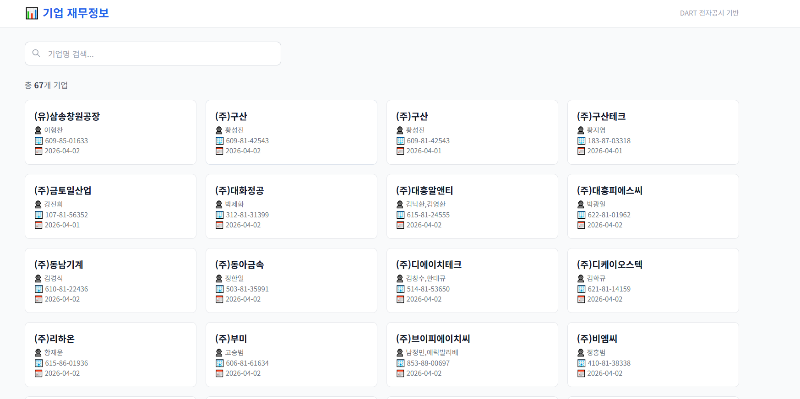

# PROJECT_SEHWAN Command Cheatsheet

## 1) CSV -> SQLite (`reports.db`) import

### A. `csv/` 폴더의 CSV를 전부 import (기본 동작)
```powershell
python ".\import_report_csv.py"
```

### B. 특정 CSV 1개만 import (기본 DB: `.\reports.db`)
```powershell
python ".\import_report_csv.py" ".\csv\20260330_평화홀딩스(주)_new csv.csv"
```

### C. DB 경로 지정해서 import
```powershell
python ".\import_report_csv.py" ".\csv\20260330_평화홀딩스(주)_new csv.csv" --db ".\data\reports.db"
```

## 2) SQLite -> Excel (`reports_by_company.xlsx`) export

### A. 회사별 시트(값만)로 내보내기
```powershell
python ".\export_reports_excel.py" --db ".\reports.db" --out "reports_by_company.xlsx"
```

### B. 회사별 시트에 `report_notes`까지 같이 내보내기
```powershell
python ".\export_reports_excel.py" --db ".\reports.db" --out "reports_by_company.xlsx" --include-notes
```

## 3) 로컬 웹 서버 (포트 8000)

Excel 다운로드가 `{"detail":"Not Found"}` 이면, **예전 uvicorn이 8000을 잡고 있는 경우**가 많습니다. 아래로 포트를 비운 뒤 다시 띄우세요.

```powershell
powershell -ExecutionPolicy Bypass -File ".\scripts\run-dev.ps1"
```

## 4) Git 저장(커밋)

1. git add .
2. git commit -m "할말"
3. git push

끝
만약 안되면 터미널에 안되는이유 확인하고 오류내용 복사 후 에이전트한테 물어보기

